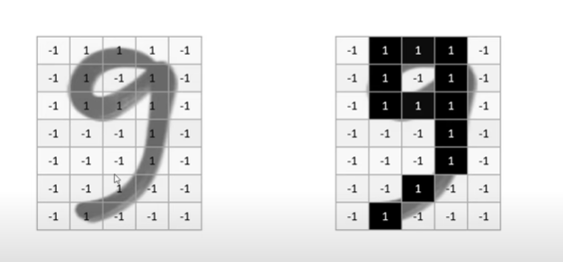
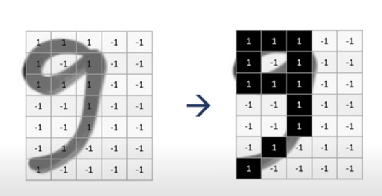
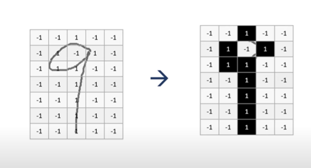
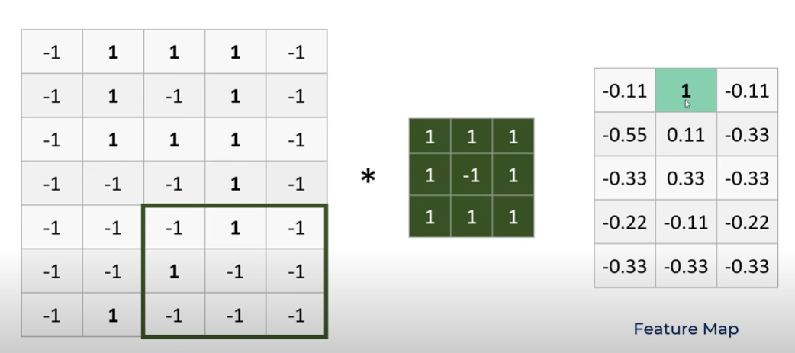
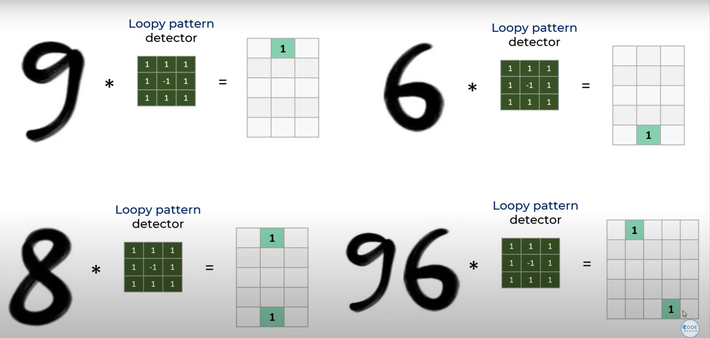
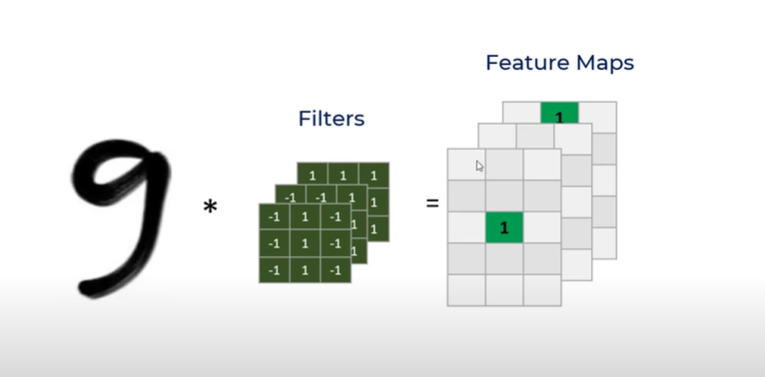

- Let's take example of digits classification in CNN
- We are given an handwritten number 9 , and we have to recognise it.
- Problem is every person draws it differently.
   (Here 9 is in middle) (1 represent black, where 9 is written, and remaining pixels are -1)
   (Here 9 is in left side)
   (Here there is no curvature in the lower part)
- So there is a pattern to recognise 9, 9 has a loop in the top, and a vertical line in the middle and a diagonal line in the lower part.
- So to detect these we have 3 kernels(filters)
- 
  This is the kernel to detect loop. It iterates over whole image and then finds ki kis position par loop hai. Feature mao mai jaha 1 hai vaha loop hai.
- 
  9 ke feature map mai uper 1 hai since uper hai loop and 6 ke feature map mai neeche hai 1 since loop neche hai 
- Similarly baaki 2 filters bhi apply karo and then unke bhi feature map banao
  
- Ye abhi feature extraction hua.These extracted features ki loop kis position mai hai, straight line kis position mai hai are now fed to Neural Network.
