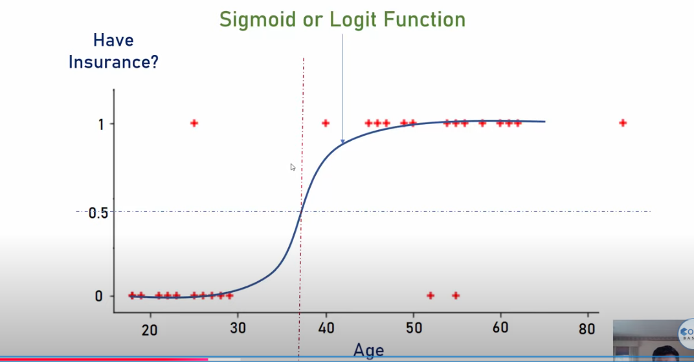
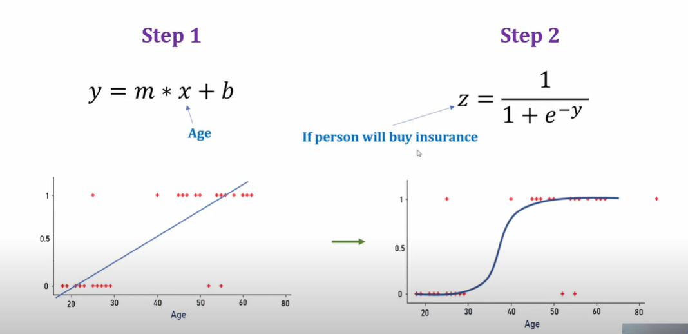
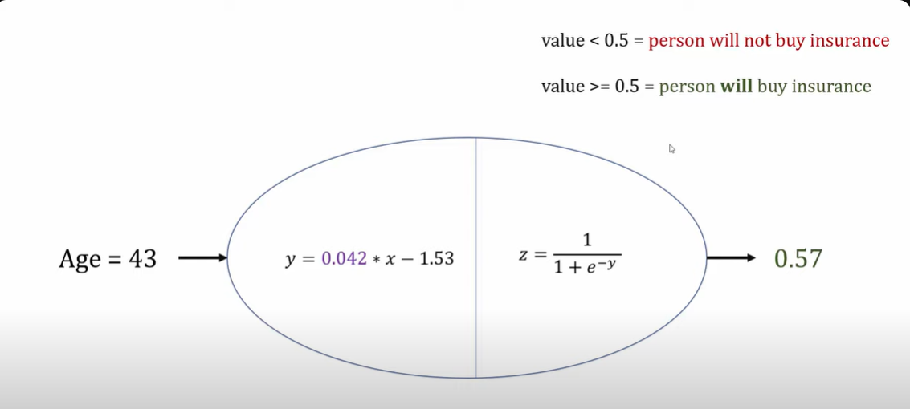
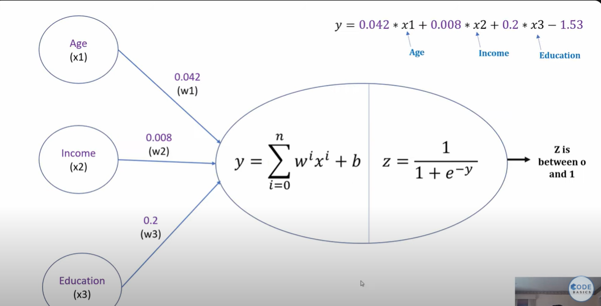

Lets take example of this binary classification problem, where a person age is given and we have to find whether the person will have the insurance or not  

Since there are only 2 outputs either 0(no insurance) or 1(insurance), so this problem can be easily solved by Logistic Regression.  

  

The sigmoid function, gives output in [0,1] range  

what it does is, voh age(x) lega input and y=m(age)+b equation banaega and then y ko sigmoid mai daal dega and we will find m,b such that the cost function gives min error

suppose the value of m and b comes out to be 0.042, -1.53

now this model is trained , now it will take input age, calculate y, calculate z, and if z is <0.5 then no insurance else vice versa

Point is ki abhi sirf ek input hai i.e age there can be multiple inputs, so y will be a linear function of multiple inputs-:  

This ellipse is called Neuron.The right component is the activation function and the left part does some operations on features.

