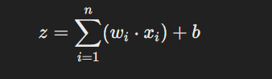

In the context of **Deep Learning**, a **neuron** (or node) is a fundamental computational unit of a **neural network**, inspired by biological neurons in the human brain. 

### **Components of a Neuron (in Deep Learning):**
1. **Inputs**: Represent the data or signals received by the neuron, often numerical features from the dataset or outputs from other neurons.
2. **Weights**: Each input has an associated weight that determines its importance. Weights are adjusted during training.
3. **Bias**: A constant value added to the weighted sum to shift the output, helping the model capture patterns more effectively.
4. **Summation**: The neuron computes a weighted sum of its inputs and adds the bias:  
     
   Where Wi is the weight, Xi is the input, and b is the bias.
5. **Activation Function**: Applies a non-linear transformation to the summation result \( z \), introducing non-linearity into the model. Common activation functions include:
   
6. **Output**: The result of the activation function is passed to the next layer or becomes the final prediction.

### **How It Works in a Neural Network:**
- Neurons are organized into layers:
  - **Input Layer**: Neurons take raw data as inputs.
  - **Hidden Layers**: Neurons process the data and pass it to subsequent layers.
  - **Output Layer**: Neurons produce the final prediction or classification result.
- Each neuron in one layer is connected to neurons in the next layer, forming a network.

### **Biological Analogy**:
- Similar to how biological neurons transmit signals in the brain, artificial neurons take inputs, process them, and pass the signal forward based on a decision.

### **Visualization**:
You can imagine a neuron as a node in a graph where:
- Edges represent **weights** (importance of connections).
- Nodes compute a function using inputs, weights, and biases to produce an output.

This simple unit, when connected in large numbers and multiple layers, enables a neural network to learn complex patterns.