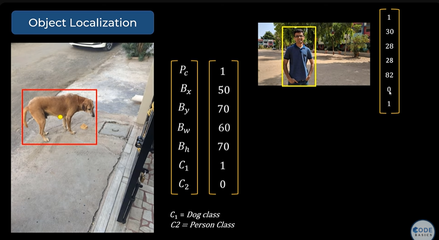
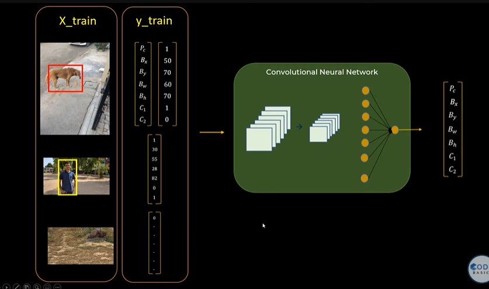
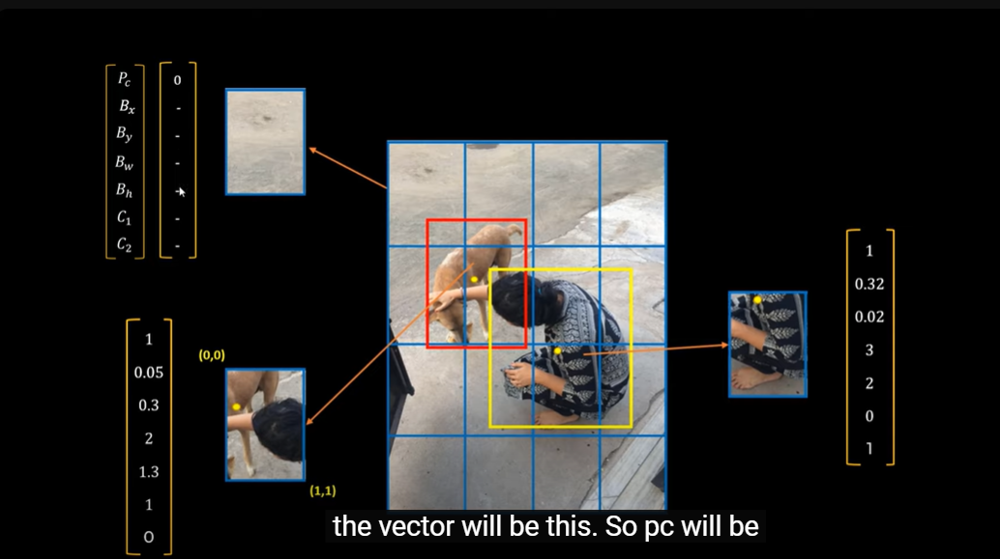
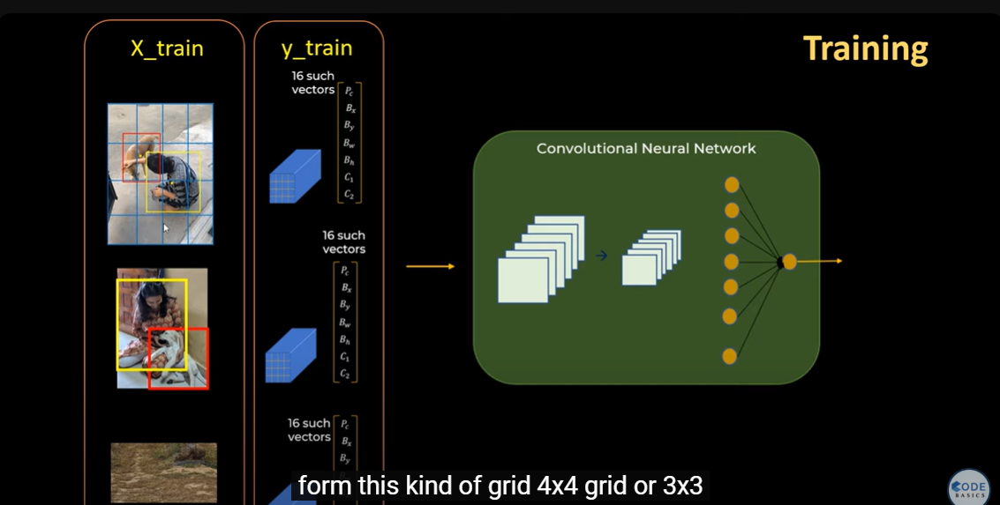
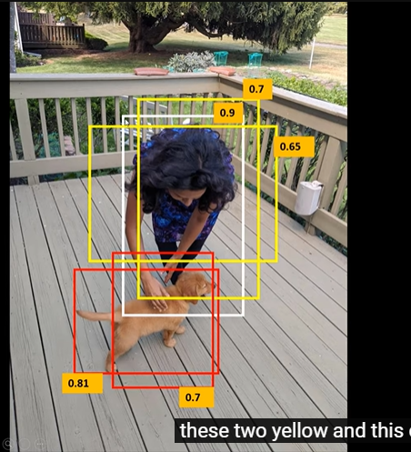

Here in the images-:
- (Bx,By) are coordinates of center of the object
- Bw,Bh are width and height of the bounding box
- C1 and C2 are two classes (persona and dog). If C1 is 1 means it is a dog else if C2 is 1 then it is a person
- Pc is the probability of the of object of class C lying in the bounding box. In the first image there is 1.0 probability that a dog is in the bounding box
- we can now train the neural network , by providing such photos with their respective vectors. Photos are X_train and vectors will be Y_train  
- Now if you give new image to this neural network, it will give the output vector
- Problem arises when there are multiple objects in the image. Toh image ko grids mai divide krte hai, and har grid ka vector nikaalte hai.
- see if you look this image, ise grid mai break kiya and har grid ka vector banaya, dog 4 grids cover kr rha hai, but un 4 mai se 3 ke vectors mai kuch nhi hoga kuiki vaha dog ka ceter nhi hai last grid mai dog ka center hai toh vaha ke vector mai bounding box ki info hogi.   
- Toh ab hum multiple object s vaali image se train krege and training data mai khud grids hogi, Lets say there are N x M grids in a image toh ek image ke liye you will provide N*M*7 size. 7 is the length of the vector. 
- So see it is simple regression, not a complicated algorithm
- First issue is that it will detect multiple bounding box of same object having different probabilities. Toh hum IOU se overlapping area nikalte hi and agar IOU jyada hai toh sirf us bounding box ko rakho jiska prob. highest hai and baaki ko nikaal do 

---
# GPT-VERSION
### **YOLO (You Only Look Once) - Object Detection Algorithm**
YOLO (You Only Look Once) is a state-of-the-art, real-time object detection algorithm that can detect multiple objects in an image simultaneously. Unlike traditional object detection techniques that use region proposal-based methods (like R-CNN), YOLO treats object detection as a single regression problem, predicting class probabilities and bounding box coordinates directly from the image in one forward pass of the neural network.

---

## **1. How YOLO Works**
YOLO divides an image into a grid and simultaneously predicts bounding boxes and class probabilities for each grid cell.

### **Step-by-Step Process:**
1. **Input Image & Preprocessing**
    - The input image is resized to a fixed size (e.g., 416×416 or 608×608 pixels).
    - Normalization is applied to improve convergence.

2. **Grid Division**
    - The image is divided into an \( S \times S \) grid (e.g., 13×13 for YOLOv3).
    - Each grid cell is responsible for detecting objects whose center falls inside it.

3. **Bounding Box Predictions**
    - Each grid cell predicts **B bounding boxes** (e.g., 3 or 5 per cell).
    - A bounding box consists of:
        - \( x, y \) (center coordinates relative to the grid cell)
        - \( w, h \) (width and height relative to the entire image)
        - \( P_c \) (object confidence score)

4. **Class Predictions**
    - Each grid cell also predicts **C class probabilities** (e.g., 80 classes for COCO dataset).
    - The final score for a bounding box is computed as:  
      \[
      P(class) \times P_c
      \]
    - This score represents how confident YOLO is that the bounding box contains an object of a particular class.

5. **Non-Maximum Suppression (NMS)**
    - Since multiple bounding boxes may be predicted for the same object, **Non-Maximum Suppression (NMS)** is used to keep only the best one.
    - It removes overlapping boxes based on **Intersection over Union (IoU)** and confidence scores.

6. **Final Output**
    - The model outputs a set of **final bounding boxes with class labels and confidence scores**.

---

## **2. YOLO Network Architecture**
The backbone of YOLO varies across versions:
- **YOLOv1** used GoogLeNet-inspired architecture.
- **YOLOv2 (YOLO9000)** used **Darknet-19**.
- **YOLOv3** used **Darknet-53**.
- **YOLOv4 & YOLOv5** improved detection using **CSPDarkNet**.
- **YOLOv7 & YOLOv8** use modern CNN optimizations.

---

## **3. Advantages of YOLO**
- **Real-time Speed**: Unlike R-CNN or Faster R-CNN, YOLO performs detection in a **single forward pass** of the network.
- **Global Context**: YOLO sees the entire image at once, avoiding region proposal bottlenecks.
- **High Accuracy**: Newer versions (YOLOv4, YOLOv5, etc.) have improved performance on small and overlapping objects.

## **4. Limitations of YOLO**
- Struggles with **small objects** due to coarse grid size.
- Less accurate than **Faster R-CNN** for highly overlapping objects.

---

## **5. YOLO Use Cases**
- **Self-Driving Cars** (detecting pedestrians, vehicles, signs)
- **Surveillance Systems** (face detection, anomaly detection)
- **Medical Imaging** (detecting tumors)
- **Industrial Automation** (defect detection in manufacturing)

---

Would you like an implementation in Python using OpenCV and YOLOv8? 🚀
