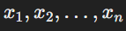
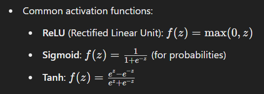

**Deep Learning** is a subset of **Machine Learning** (ML) that uses **neural networks** with many layers (hence "deep") to model and solve complex problems. Here's how they differ:  

### **Machine Learning (ML):**
1. **Definition**: A field of AI that enables systems to learn from data and improve performance without being explicitly programmed.
2. **Approach**: Often uses structured data and relies on feature extraction (manual or algorithm-driven).
3. **Examples of Techniques**:  
   - Linear Regression  
   - Decision Trees  
   - Support Vector Machines (SVM)  
4. **Application Scope**: Works well with smaller datasets and simpler patterns.

### **Deep Learning (DL):**
1. **Definition**: A subfield of ML focused on using artificial neural networks with multiple layers to model hierarchical patterns in data.
2. **Approach**: Automates feature extraction by learning features directly from raw data (images, audio, text, etc.).
3. **Architecture**: Uses multi-layered neural networks like Convolutional Neural Networks (CNNs) for images or Recurrent Neural Networks (RNNs) for sequences.
4. **Data Requirements**: Requires large amounts of labeled data and high computational power (e.g., GPUs/TPUs).
5. **Examples**:  
   - Image Classification (e.g., cats vs. dogs)  
   - Natural Language Processing (e.g., chatbots)  
   - Autonomous Vehicles  

### **Key Differences:**
| **Aspect**               | **Machine Learning**                                | **Deep Learning**                           |
|---------------------------|----------------------------------------------------|---------------------------------------------|
| **Feature Extraction**    | Manual                                             | Automatic                                   |
| **Data Requirement**      | Less data needed                                   | Requires large datasets                     |
| **Complexity**            | Simpler problems                                   | Complex problems                            |
| **Performance**           | Limited for unstructured data                     | Excels in unstructured data (images, text)  |
| **Computation**           | Less computationally intensive                    | Requires more computational resources       |

Deep Learning is often considered the next step in ML for handling highly complex tasks, particularly where data is vast and unstructured.

---

Deep learning consists of several key components:

1. **Neural Networks** – The backbone of deep learning, consisting of interconnected layers of neurons.
   - **Input Layer** – Takes in data (e.g., images, text).
   - **Hidden Layers** – Perform computations and extract features.
   - **Output Layer** – Produces the final result (e.g., classification, regression).

2. **Activation Functions** – Introduce non-linearity to the network. Common ones include:
   - ReLU (Rectified Linear Unit)
   - Sigmoid
   - Tanh
   - Softmax

3. **Loss Function** – Measures how well the model's predictions match the expected results. Examples:
   - Mean Squared Error (MSE) for regression
   - Cross-Entropy for classification

4. **Optimization Algorithm** – Adjusts weights to minimize the loss function. Common optimizers:
   - Gradient Descent
   - Adam (Adaptive Moment Estimation)
   - RMSprop

5. **Backpropagation** – The process of propagating errors backward through the network to update weights.

6. **Training Data** – Large datasets required to train deep learning models. Examples:
   - ImageNet (for images)
   - COCO (for object detection)
   - IMDb (for text sentiment analysis)

7. **Batch Normalization & Regularization** – Techniques to improve training stability and prevent overfitting.
   - Dropout
   - L2 Regularization (Weight Decay)

8. **Hardware & Frameworks** – Deep learning requires high computational power.
   - **GPUs/TPUs** – Accelerate computations.
   - **Frameworks** – TensorFlow, PyTorch, Keras.

---

### **Role of Neurons in Deep Learning**

Neurons are the fundamental building blocks of a neural network, inspired by biological neurons in the human brain. Their role is to process and transmit information through the network.

### **How a Neuron Works?**
Each neuron in a neural network performs the following operations:

#### **1. Receive Inputs (Features or Outputs from Previous Layer)**
- Each neuron takes multiple inputs  from the dataset or the previous layer.
- Each input has an associated weight (w1,w2,w3...wn)

#### **2. Compute Weighted Sum**
- The neuron computes a weighted sum of its inputs:  

  where **\( b \) (bias)** is an additional parameter to adjust the activation.

#### **3. Apply Activation Function**
- The weighted sum \( z \) is passed through an **activation function** \( f(z) \) to introduce non-linearity.
- 

#### **4. Transmit Output to Next Layer**
- The activated value is passed to neurons in the next layer as input.

### **Neurons in a Neural Network**

1️⃣ **Input Layer Neurons** – Receive raw data and pass it to the next layer.  
2️⃣ **Hidden Layer Neurons** – Extract patterns and features from data through multiple transformations.  
3️⃣ **Output Layer Neurons** – Generate final predictions (classification labels, regression values, etc.).

### **Why Are Neurons Important?**
✔ **Learn Patterns & Features** – Each neuron captures different aspects of data.  
✔ **Enable Deep Learning** – Stacking many neurons in deep layers helps model complex relationships.  
✔ **Control Model Complexity** – The number of neurons and layers determines network depth and expressiveness.

